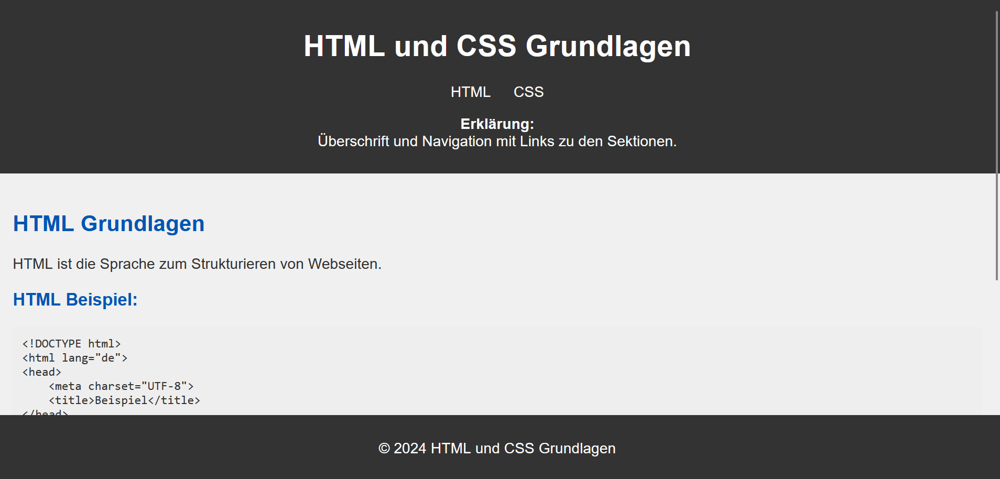
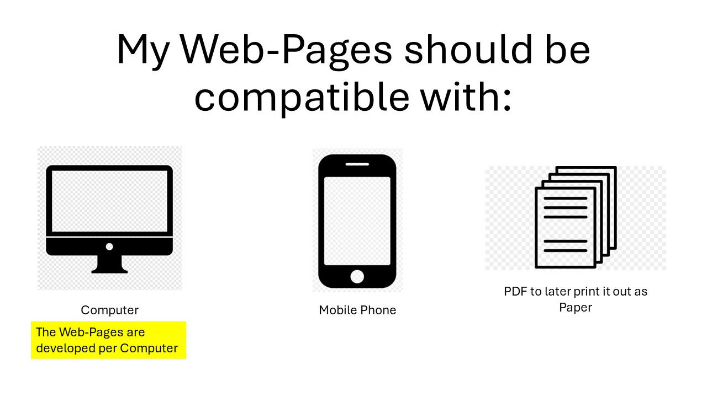

# My Learning Websites  

This repository contains my personal basic learning material related to web development.

## Live Preview  

You can view the live version of my project using Githack:  

🔗 **[Live Website](https://rawcdn.githack.com/KLubina/learning-website-basics-of-web-development/1612b7d79722385fed685e4747abfeec433ebb02/index.html)**  

## Page Preview  

Here’s a preview of one of my web pages:  

  

## Browser Compatibility  

An basic idea of mine is that my web pages are designed to be compatible with multiple browsers and devices:  

